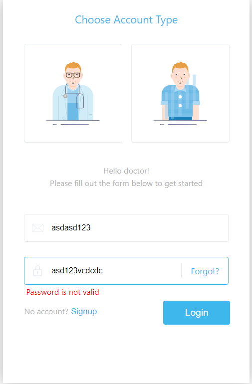

## Project goal

this project is a demo project of UI component of login page

## Available Scripts

In the project directory, you can run:

### `yarn start`

Runs the app in the development mode.\
Open [http://localhost:3000](http://localhost:3000) to view it in the browser.

The page will reload if you make edits.\
You will also see any lint errors in the console.

### Demo

Codesandbox Link: https://codesandbox.io/s/cocky-goldberg-n0di0

